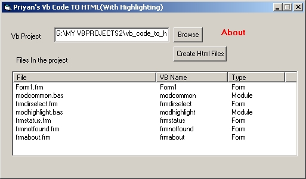



## Vb Code To HTml

### Description

Creates html files of your vb project with highlighting and

creates an index page
 
### More Info
 

             |
---                |---
**Submitted On**   |2003-12-17 18:15:50
**By**             |[Priyan R](https://github.com/Planet-Source-Code/PSCIndex/blob/master/ByAuthor/priyan-r.md)
**Level**          |Intermediate
**User Rating**    |4.3 (13 globes from 3 users)
**Compatibility**  |VB 6\.0
**Category**       |[Complete Applications](https://github.com/Planet-Source-Code/PSCIndex/blob/master/ByCategory/complete-applications__1-27.md)
**World**          |[Visual Basic](https://github.com/Planet-Source-Code/PSCIndex/blob/master/ByWorld/visual-basic.md)
**Archive File**   |[Vb\_Code\_To16848212182003\.zip](https://github.com/Planet-Source-Code/priyan-r-vb-code-to-html__1-50498/archive/master.zip)

